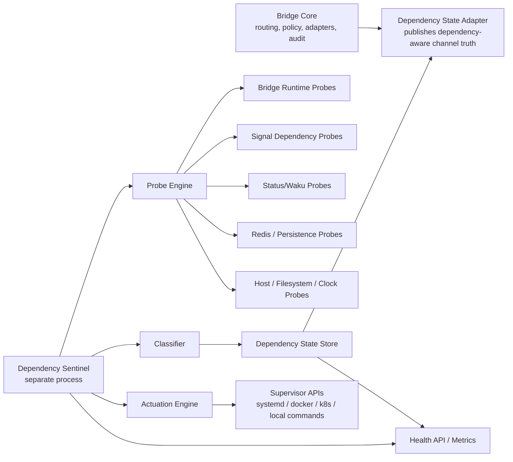

# Dependency Sentinel Technical Design

## 1. Purpose

OpenClaw OmniBridge has now demonstrated that route truth and delivery truth are not the same thing.

In the recent founder-phase evidence runs, the bridge was able to:

1. accept inbound messages;
2. authenticate them;
3. normalize them;
4. apply policy;
5. emit accepted and forwarded audit events;
6. and still fail to achieve final delivery when a downstream service outside the bridge core was unavailable.

That result is not a minor edge case. It is a design signal.

It means OmniBridge is moving out of the stage where "the code path exists" is an adequate definition of readiness. The project now needs a separate reliability layer that continuously observes the actual dependency chain behind each route and can:

1. classify failures correctly;
2. degrade truthfully;
3. perform bounded self-healing where safe;
4. and escalate when human intervention is required.

This document defines that reliability layer as **OpenClaw Dependency Sentinel**.

## 2. Problem Statement

At present, the runtime common-knowledge surface can overstate health.

In the current implementation:

1. the runtime reports channel health as whether an adapter object exists;
2. route state is derived from those channel-health booleans;
3. and the primary runtime server does not expose a canonical dependency-aware health/readiness surface.

This creates an operational gap:

1. a route may appear active even when one or more downstream dependencies are unavailable;
2. operators cannot cleanly distinguish bootstrap failure, contract failure, dependency failure, and routing failure;
3. automation cannot perform bounded recovery because failure classes are not explicit;
4. external orchestrators cannot decide when the bridge is merely alive versus actually ready;
5. and audit evidence can prove routing while leaving dependency weakness hidden.

Industrial-strength bridge reliability requires a distinct dependency model.

## 3. Design Goals

Dependency Sentinel must:

1. continuously monitor the full dependency graph behind the bridge;
2. distinguish liveness, readiness, route health, and dependency health;
3. classify failures into operationally useful categories;
4. perform safe, pre-authorized recovery actions for local recoverable failures;
5. publish truthful machine-readable health surfaces;
6. integrate with the existing audit and common-knowledge model;
7. avoid widening trust or silently mutating policy;
8. remain useful whether OmniBridge runs under systemd, Docker, or Kubernetes;
9. support founder-phase local workflows without being designed only for localhost.

## 4. Non-Goals

Dependency Sentinel is not intended to:

1. rewrite policy automatically;
2. rotate or invent secrets autonomously;
3. widen allowlists automatically;
4. claim human-visible Status/Desktop proof when only bridge-routing proof exists;
5. replace external orchestration platforms;
6. mask persistent dependency outages behind indefinite retries.

Its function is bounded repair plus truthful degradation, not magical concealment of failure.

## 5. Architectural Principle

Dependency Sentinel should be implemented as a **separate module and separately runnable process**, not as hidden logic buried in the bridge engine.

This separation is required because:

1. an in-process checker dies or wedges with the process it is checking;
2. reliability control and message-routing control are different responsibilities;
3. health observation needs to include dependencies outside the bridge runtime itself;
4. a separate module can supervise multiple local processes, not just the Node process;
5. and governance is cleaner when observation, actuation, and policy evaluation are not entangled.

## 6. High-Level Architecture



## 7. Module Boundaries

The first-pass implementation should introduce the following logical modules.

### 7.1 Bridge Core

Existing responsibility:

1. ingest;
2. verify;
3. normalize;
4. route;
5. audit;
6. emit common-knowledge offers.

Required change:

1. stop treating "adapter exists" as equivalent to "channel healthy";
2. consume dependency state published by Dependency Sentinel or a local dependency-state adapter;
3. expose canonical runtime and readiness endpoints.

### 7.2 Dependency State Model

New shared domain types for:

1. dependency identifiers;
2. dependency kind;
3. probe result;
4. failure classification;
5. dependency state;
6. route state derivation;
7. recovery policy;
8. incident severity.

Recommended files:

1. `src/reliability/types.ts`
2. `src/reliability/dependency-registry.ts`
3. `src/reliability/route-health.ts`

### 7.3 Probe Engine

Responsible for running probes on a schedule and recording raw results.

Probe classes:

1. static/bootstrap probes;
2. HTTP probes;
3. TCP probes;
4. file/path probes;
5. process/supervisor probes;
6. semantic canary probes;
7. dependency-specific protocol probes.

Recommended files:

1. `src/sentinel/probes/base.ts`
2. `src/sentinel/probes/http.ts`
3. `src/sentinel/probes/tcp.ts`
4. `src/sentinel/probes/file.ts`
5. `src/sentinel/probes/process.ts`
6. `src/sentinel/probes/redis.ts`
7. `src/sentinel/probes/signal.ts`
8. `src/sentinel/probes/status.ts`
9. `src/sentinel/probes/runtime.ts`

### 7.4 Classifier

Converts probe failures into operational meaning.

Examples:

1. route-contract mismatch;
2. env/bootstrap failure;
3. dependency unavailable;
4. dependency degraded;
5. credential or allowlist mismatch;
6. persistence unavailable;
7. process stalled;
8. publish path broken but ingest path healthy.

Recommended file:

1. `src/sentinel/classifier.ts`

### 7.5 Actuation Engine

Executes bounded recovery steps when and only when policy allows.

Examples:

1. restart signal-cli daemon through systemd;
2. restart OmniBridge runtime if the process is dead or watchdog-expired;
3. trigger Waku reconnect;
4. reload runtime after config checksum change;
5. mark routes degraded if recovery budget is exhausted.

Recommended files:

1. `src/sentinel/actuators/base.ts`
2. `src/sentinel/actuators/systemd.ts`
3. `src/sentinel/actuators/docker.ts`
4. `src/sentinel/actuators/noop.ts`
5. `src/sentinel/recovery-policy.ts`

### 7.6 Health Surface

Machine-readable interfaces for operators and orchestrators.

Required outputs:

1. `GET /healthz`
2. `GET /readyz`
3. `GET /dependencies`
4. `GET /routes`
5. metrics endpoint

Recommended files:

1. `src/sentinel/server.ts`
2. `src/sentinel/serializers.ts`

### 7.7 Persistence and Incident Memory

The sentinel needs lightweight memory even if the bridge itself is running in memory mode.

Use cases:

1. flap detection;
2. cooldown enforcement;
3. recovery-attempt budgets;
4. last-known-good timestamps;
5. dependency state transitions;
6. incident deduplication.

Recommended first-pass:

1. in-memory state with durable audit emission;
2. optional Redis backend in a later pass.

## 8. Dependency Inventory

Dependency Sentinel should treat the bridge as a dependency graph, not a flat service.

### 8.1 Bootstrap Dependencies

1. `.env` or equivalent env source loaded correctly
2. `OPENCLAW_POLICY_PATH` exists and parses
3. audit directory writable
4. startup command is compatible with env-loading assumptions
5. config checksum known

### 8.2 Core Runtime Dependencies

1. Node process alive
2. HTTP server bound to expected port
3. audit log append succeeding
4. process making forward progress
5. clock not severely skewed

### 8.3 Persistence Dependencies

1. in-memory mode explicitly acknowledged, or
2. Redis reachable and responsive if enabled

### 8.4 Signal Dependencies

Ingress:

1. correct webhook path: `/webhooks/signal`
2. expected payload shape: signal-cli envelope
3. trusted peer configuration aligned with policy

Egress:

1. signal-cli compatible daemon process available
2. RPC endpoint reachable
3. account registered and in usable state
4. receive freshness within expected bounds
5. send endpoint compatible with deployed signal-cli surface

### 8.5 Status Dependencies

1. Status channel enabled with complete config
2. private key present
3. Waku bootstrap peers reachable
4. community/chat/topic bindings correct
5. Waku publish path healthy
6. local status shim shared secret valid if shim is enabled

### 8.6 Supervisor Dependencies

1. systemd service configured, or
2. container orchestrator readiness and restart policy configured, or
3. explicit founder-phase local supervisor mode acknowledged

## 9. Dependency State Machine

Each dependency should occupy exactly one state at any point in time.

### 9.1 States

1. `UNKNOWN`
2. `CONFIGURED`
3. `STARTING`
4. `HEALTHY`
5. `DEGRADED`
6. `UNAVAILABLE`
7. `RECOVERING`
8. `QUARANTINED`

### 9.2 Meaning

| State | Meaning |
|---|---|
| `UNKNOWN` | Sentinel has not yet probed or has insufficient evidence. |
| `CONFIGURED` | Dependency is declared and syntactically configured but not yet proven ready. |
| `STARTING` | Dependency is booting or warming and should not yet receive traffic. |
| `HEALTHY` | Dependency is passing all required probes and is fit for traffic. |
| `DEGRADED` | Dependency is partially functional or intermittently failing; traffic policy may narrow. |
| `UNAVAILABLE` | Dependency is not delivering its required function. |
| `RECOVERING` | Sentinel is applying an authorized repair action. |
| `QUARANTINED` | Dependency is intentionally isolated because automated recovery is unsafe or exhausted. |

### 9.3 Transitions

Valid transitions should be explicit:

1. `UNKNOWN -> CONFIGURED`
2. `CONFIGURED -> STARTING`
3. `STARTING -> HEALTHY`
4. `STARTING -> DEGRADED`
5. `HEALTHY -> DEGRADED`
6. `DEGRADED -> HEALTHY`
7. `DEGRADED -> UNAVAILABLE`
8. `UNAVAILABLE -> RECOVERING`
9. `RECOVERING -> HEALTHY`
10. `RECOVERING -> DEGRADED`
11. `RECOVERING -> QUARANTINED`
12. `UNAVAILABLE -> QUARANTINED`
13. `QUARANTINED -> CONFIGURED` only after explicit human acknowledgement or a configured release rule

### 9.4 Route State Derivation

Route state should be derived from the dependency set behind that route.

Recommended route states:

1. `ACTIVE`
2. `DEGRADED`
3. `UNAVAILABLE`
4. `MISCONFIGURED`

Example:

`status -> signal` should not be `ACTIVE` merely because the Signal adapter object exists. It should be `ACTIVE` only when:

1. Status ingress dependencies are healthy enough to accept the message;
2. bridge core is healthy;
3. Signal egress dependency is healthy;
4. persistence dependencies are healthy enough for configured safety guarantees.

## 10. Probe Catalog

Probe frequency and aggressiveness should vary by type.

### 10.1 Startup Probes

Run once at startup and after reload.

| Probe | Checks | Failure class |
|---|---|---|
| Env load probe | expected env vars present; runtime command matches deployment mode | bootstrap failure |
| Policy path probe | file exists, parses, hash recorded | config failure |
| Audit path probe | directory writable, append succeeds | filesystem failure |
| Config coherence probe | enable flags consistent with required fields | misconfiguration |

### 10.2 Liveness Probes

Run frequently and cheaply.

| Probe | Checks | Failure class |
|---|---|---|
| Bridge process probe | process alive / port bound | process down |
| Audit progress probe | recent append or heartbeat activity | stalled runtime |
| Redis ping probe | `PING` returns expected response | persistence unavailable |
| Signal RPC TCP probe | socket reachable | downstream unavailable |
| Waku connectivity probe | basic connectivity to bootstrap peer(s) | network unavailable |

### 10.3 Readiness Probes

Run continuously and determine traffic eligibility.

| Probe | Checks | Failure class |
|---|---|---|
| Bridge readiness probe | runtime initialized, config valid, dependency state available | startup incomplete |
| Signal egress readiness | send endpoint usable, daemon healthy, account fresh enough | route degraded |
| Status publish readiness | Waku connected and publish path viable | route degraded |
| Replay/rate-limit readiness | required store available for configured mode | safety degradation |

### 10.4 Contract Probes

Validate interfaces instead of mere socket presence.

| Probe | Checks | Failure class |
|---|---|---|
| Signal webhook contract probe | `/webhooks/signal` exists and accepts expected shape | path/schema mismatch |
| Status local shim contract probe | `/internal/status-shim/messages` accepts expected auth and payload | ingress contract mismatch |
| Offers truth probe | route status reflects actual dependency health | truth-surface mismatch |

### 10.5 Semantic Canary Probes

Run at lower frequency because they are more expensive.

| Probe | Checks | Failure class |
|---|---|---|
| Status -> Signal canary | accepted, forwarded, downstream send path usable | route-level degradation |
| Signal -> Status canary | accepted, forwarded, Status publish path usable | route-level degradation |
| Payload canary | bounded larger payload still traverses route | envelope degradation |

Canaries should use clearly tagged synthetic IDs and be auditable.

## 11. Failure Classification Model

The classifier should output both a category and an operational recommendation.

### 11.1 Categories

1. `BOOTSTRAP_CONFIG_ERROR`
2. `ROUTE_CONTRACT_ERROR`
3. `SCHEMA_MISMATCH`
4. `PROCESS_DOWN`
5. `PROCESS_STALLED`
6. `DEPENDENCY_UNREACHABLE`
7. `DEPENDENCY_AUTH_ERROR`
8. `DEPENDENCY_VERSION_DRIFT`
9. `PERSISTENCE_UNAVAILABLE`
10. `FILESYSTEM_UNWRITABLE`
11. `NETWORK_DEGRADED`
12. `RECOVERY_EXHAUSTED`
13. `UNSAFE_TO_AUTOHEAL`

### 11.2 Example Classifications

| Observation | Classification | Meaning |
|---|---|---|
| bare `node dist/src/index.js` starts without needed env | `BOOTSTRAP_CONFIG_ERROR` | operator launch mode invalid |
| request sent to `/webhook/signal` instead of `/webhooks/signal` | `ROUTE_CONTRACT_ERROR` | caller hit wrong interface |
| signal-cli envelope missing expected structure | `SCHEMA_MISMATCH` | caller payload invalid |
| bridge forwards but send fails because `127.0.0.1:8081` is down | `DEPENDENCY_UNREACHABLE` | route logic healthy; Signal delivery dependency unavailable |
| Status channel enabled but zero Waku bootstrap peers | `BOOTSTRAP_CONFIG_ERROR` | Status dependency set incomplete |

## 12. Self-Healing Policy

Self-healing must be bounded and explicit.

### 12.1 Safe Automated Actions

These are reasonable first-pass automated actions:

1. restart a locally supervised signal-cli daemon;
2. restart OmniBridge on watchdog failure;
3. re-run a Waku reconnect sequence;
4. reload runtime when config file checksum changes and validation passes;
5. mark route `DEGRADED` immediately when a critical dependency becomes unavailable;
6. run a post-recovery canary before restoring `ACTIVE`.

### 12.2 Unsafe or Forbidden Automated Actions

These should not be automated in the first industrial pass:

1. editing policy files;
2. inventing or rotating secrets;
3. changing allowlists;
4. silently switching proof levels;
5. disabling verification to keep traffic flowing;
6. automatically rewriting endpoint contracts to fit malformed callers.

### 12.3 Recovery Budget Model

Every autoheal action should be bounded by:

1. retry count;
2. rolling time window;
3. cooldown period;
4. escalation threshold;
5. human acknowledgement requirement after repeated failure.

Example:

1. restart signal-cli at most 3 times in 15 minutes;
2. after 3 failures, mark Signal egress `QUARANTINED`;
3. set `status -> signal` route to `DEGRADED` or `UNAVAILABLE`;
4. emit incident event and require human action.

## 13. Public Health Surfaces

The runtime should expose canonical health surfaces in the primary server.

### 13.1 `GET /healthz`

Purpose:

1. confirm the process is alive and serving.

Should not:

1. claim route readiness.

Example response:

```json
{
  "ok": true,
  "runtimeId": "4f8a6f...",
  "processState": "alive",
  "timestamp": "2026-03-30T12:00:00.000Z"
}
```

### 13.2 `GET /readyz`

Purpose:

1. confirm the bridge is ready for traffic based on dependency truth.

Example response:

```json
{
  "ok": false,
  "ready": false,
  "reason": "signal-egress-unavailable",
  "degradedRoutes": ["status.to.signal"],
  "timestamp": "2026-03-30T12:00:00.000Z"
}
```

### 13.3 `GET /dependencies`

Purpose:

1. expose dependency-by-dependency state.

### 13.4 `GET /routes`

Purpose:

1. publish route-level deliverability truth derived from dependency state.

This endpoint should become the source of truth behind `/offers` and `/offers.txt`.

## 14. Integration with Common Knowledge

The common-knowledge service should stop deriving health from adapter presence alone.

Recommended change:

1. replace `isChannelHealthy(channel)` boolean callback with a dependency-aware state provider;
2. derive surface offers from dependency state;
3. derive route offers from route-state calculation;
4. include explicit reasons such as:
   - `signal_rpc_unreachable`
   - `waku_bootstrap_unreachable`
   - `redis_unavailable`
   - `policy_path_missing`

This is crucial because OmniBridge’s public truth surface must become operationally honest.

## 15. Deployment Model

### 15.1 Founder-Phase Local Mode

The sentinel runs as a sibling local process and can:

1. probe localhost services;
2. classify failures;
3. emit dependency state;
4. optionally invoke local restart commands if explicitly configured.

### 15.2 systemd Mode

Recommended industrial baseline:

1. run `openclaw-omnibridge.service`
2. run `openclaw-sentinel.service`
3. configure `Restart=on-failure`
4. enable `WatchdogSec=`
5. wire restart permissions explicitly

### 15.3 Kubernetes Mode

Use:

1. startup probes for slow initialization;
2. liveness probes for deadlock/stall detection;
3. readiness probes for dependency truth;
4. optional sidecar sentinel or separate controller deployment.

## 16. Security Posture

Dependency Sentinel increases operational power and therefore must be constrained.

Controls:

1. all actuation actions must be allowlisted;
2. restart commands must be explicit, not shell-interpolated guesses;
3. state changes must be auditable;
4. secret values must never be emitted in health surfaces;
5. dependency diagnostics may identify missing or invalid configuration, but not reveal secret contents;
6. quarantine state must be preserved until recovery is actually proven.

## 17. First-Pass File and Module Layout

Recommended additions:

1. `src/reliability/types.ts`
2. `src/reliability/dependency-registry.ts`
3. `src/reliability/route-health.ts`
4. `src/reliability/runtime-health.ts`
5. `src/sentinel/index.ts`
6. `src/sentinel/server.ts`
7. `src/sentinel/classifier.ts`
8. `src/sentinel/recovery-policy.ts`
9. `src/sentinel/probes/runtime.ts`
10. `src/sentinel/probes/signal.ts`
11. `src/sentinel/probes/status.ts`
12. `src/sentinel/probes/redis.ts`
13. `src/sentinel/probes/filesystem.ts`
14. `src/sentinel/actuators/systemd.ts`
15. `src/sentinel/actuators/noop.ts`
16. `src/sentinel/state-store.ts`
17. `src/sentinel/types.ts`

Recommended modifications:

1. `src/server.ts`
2. `src/runtime.ts`
3. `src/common-knowledge/service.ts`
4. `src/index.ts`
5. `docs/12_OPERATIONS_RUNBOOK.md`

## 18. First-Pass Implementation Plan

Implementation should be phased so that truthfulness improves before automation power increases.

### Phase A: Truthful Health Surfaces

Objective:

1. stop overstating route health.

Work:

1. add dependency-state types;
2. add `healthz` and `readyz` to the primary runtime server;
3. implement basic probes for:
   - process alive
   - policy path valid
   - audit path writable
   - Redis reachable if configured
   - Signal RPC reachable if Signal enabled
   - Waku bootstrap nodes present and dial attempt state visible if Status enabled
4. wire common-knowledge route state to these results.

Exit condition:

1. `/offers.txt` no longer claims a route is active when the downstream dependency is unavailable.

### Phase B: Sentinel Process

Objective:

1. move from in-process truth to separate-process observation.

Work:

1. add `src/sentinel/index.ts`;
2. add periodic probe scheduler;
3. expose `/dependencies` and `/routes`;
4. persist last-known-good and transition history;
5. emit structured incident events.

Exit condition:

1. dependency state survives brief bridge-process disruption and remains visible externally.

### Phase C: Bounded Recovery

Objective:

1. recover safe local dependency failures automatically.

Work:

1. add actuation abstraction;
2. support `noop` and `systemd` actuators first;
3. implement recovery budgets and cooldowns;
4. restart signal-cli or bridge runtime only when explicitly configured;
5. require post-recovery canary before restoring route to `ACTIVE`.

Exit condition:

1. common local dependency failures recover automatically without overstating success.

### Phase D: Semantic Canaries

Objective:

1. detect route degradation beyond shallow port checks.

Work:

1. introduce low-frequency canary messages with unique tags;
2. verify accepted/forwarded evidence end to end at bridge-routing level;
3. optionally verify downstream provider acceptance where safe.

Exit condition:

1. route-level confidence is backed by periodic active verification rather than passive hope.

### Phase E: Production Hardening

Objective:

1. make the sentinel suitable for real operational environments.

Work:

1. metrics export;
2. Grafana/Prometheus integration;
3. structured alerting;
4. flap control;
5. config reload support;
6. secret-safe diagnostics;
7. failure-injection tests.

## 19. Acceptance Criteria

Dependency Sentinel first pass is successful when:

1. the main runtime exposes canonical `healthz` and dependency-aware `readyz`;
2. route state is no longer derived from adapter existence alone;
3. `status -> signal` becomes `DEGRADED` if the Signal RPC dependency is unavailable;
4. `signal -> status` becomes `DEGRADED` if Waku publish dependencies are unavailable;
5. operator-facing health output identifies the failure class without requiring transcript archaeology;
6. the sentinel can safely restart a configured local dependency and restore route readiness only after successful reprobe;
7. audit and health surfaces never overclaim human-visible proof.

## 20. Immediate Next Step

The correct first implementation step is not full auto-remediation.

It is:

1. add dependency-aware health types;
2. add canonical health/readiness endpoints to the primary runtime;
3. replace adapter-existence health with real dependency probes for Signal, Status, Redis, and filesystem bootstrap surfaces.

That step alone will move OmniBridge materially closer to industrial reliability because it changes the system from **optimistic route declaration** to **truthful operational declaration**.
